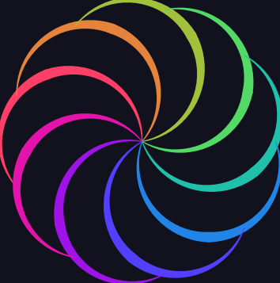

# TortoiseGraphics2

[](https://swift.org)
[](https://swift.org/package-manager)
[](LICENSE)
[](https://codecov.io/gh/temoki/TortoiseGraphics2)
[]()
[](https://temoki.github.io/TortoiseGraphics2/)

A [turtle graphics](https://en.wikipedia.org/wiki/Turtle_graphics) engine — a key feature of the [Logo](https://en.wikipedia.org/wiki/Logo_(programming_language)) programming language — written in Swift.

> **Version 2** of [TortoiseGraphics](https://github.com/temoki/TortoiseGraphics), rewritten for Swift 6 strict concurrency and SwiftUI.

```swift
let 🐢 = Tortoise()
🐢.penColor = .orange
🐢.penWidth = 2
for _ in 1...36 {
    🐢.forward(200)
    🐢.right(170)
}
```


## Gallery

Each drawing is a single-file example with a SwiftUI `#Preview` — open this
package in Xcode and pick a file under
[Sources/Examples/Gallery/](Sources/Examples/Gallery/) to watch it draw
itself. `swift run ExamplesRunner` regenerates the images below.

| <a href="Sources/Examples/Gallery/SquareSpiral.swift"></a> | <a href="Sources/Examples/Gallery/FractalTree.swift"></a> | <a href="Sources/Examples/Gallery/KochSnowflake.swift"></a> |
|:--:|:--:|:--:|
| [Square Spiral](Sources/Examples/Gallery/SquareSpiral.swift) | [Fractal Tree](Sources/Examples/Gallery/FractalTree.swift) | [Koch Snowflake](Sources/Examples/Gallery/KochSnowflake.swift) |
| <a href="Sources/Examples/Gallery/CircleRosette.swift"></a> | <a href="Sources/Examples/Gallery/FilledStar.swift"></a> | <a href="Sources/Examples/Gallery/Waves.swift"></a> |
| [Circle Rosette](Sources/Examples/Gallery/CircleRosette.swift) | [Filled Star](Sources/Examples/Gallery/FilledStar.swift) | [Waves](Sources/Examples/Gallery/Waves.swift) |
| <a href="Sources/Examples/Gallery/TaperedPetals.swift"></a> | | |
| [Tapered Petals](Sources/Examples/Gallery/TaperedPetals.swift) | | |

## Showcase

Apps built with TortoiseGraphics2:

### [TortoiseBlocks](https://github.com/temoki/TortoiseBlocks)

A visual programming app for kids — snap blocks together, press Run, and
watch the tortoise draw. Blocks expand into a Tortoise command stream
played by `TortoiseCanvas` with a `TortoisePlayer` (pause, single-step,
seek, and speed control, with the executing block highlighted), a code
pane shows the equivalent Swift program, and drawings export as SVG
straight from the library.

<a href="https://github.com/temoki/TortoiseBlocks"></a>

## Modules

| Module | Description |
|--------|-------------|
| **TortoiseCore** | Tortoise API + command stream (`Codable`). Foundation-only; no platform dependencies. |
| **TortoiseUI** | SwiftUI animated canvas view (`TimelineView` + `Canvas`). |
| **TortoiseSVG** | Tortoise → static SVG string. No platform dependencies. |

The design follows an event-sourcing pattern: `Tortoise` accumulates
`[TortoiseCommand]`; rendering is handled by separate, pure-function
consumers that replay the same stream. This makes SVG export, animation,
and testing all share a single source of truth.

## Requirements

- **Swift** 6.4+
- **Xcode** 27+ (Apple platforms)
- **Platforms** iOS 26+ · macOS 26+ · visionOS 26+ · Linux (`TortoiseCore` / `TortoiseSVG` only — `TortoiseUI` requires SwiftUI)

## Installation

Add the package in Xcode via **File › Add Package Dependencies**, or add it
to your `Package.swift`:

```swift
platforms: [
    .iOS(.v26), .macOS(.v26), .visionOS(.v26),
],
dependencies: [
    .package(url: "https://github.com/temoki/TortoiseGraphics2", from: "2.0.0"),
],
targets: [
    .target(
        name: "YourTarget",
        dependencies: [
            .product(name: "TortoiseCore", package: "TortoiseGraphics2"),
            .product(name: "TortoiseUI",   package: "TortoiseGraphics2"),
            .product(name: "TortoiseSVG",  package: "TortoiseGraphics2"),
        ]
    ),
]
```

Import only what you need — `TortoiseCore` alone is sufficient if you're
writing your own renderer. `TortoiseUI` and `TortoiseSVG` re-export
`TortoiseCore`, so importing either one already gives you `Tortoise` and the
rest of the core types.

## Usage

### Animated SwiftUI view


```swift
import TortoiseUI

struct ContentView: View {
    var body: some View {
        TortoiseCanvas { 🐢 in
            🐢.speed = 5
            🐢.penColor = .blue
            for _ in 1...4 {
                🐢.forward(100)
                🐢.right(90)
            }
        }
    }
}
```

`speed` ranges from 1 (slowest) to 10 (fastest). Set it to `0` for instant
rendering — useful for static previews.

#### Playback control

Pass a `TortoisePlayer` to pause, resume, single-step, seek, and override
the playback speed from your own UI. `currentCommandIndex` and `isFinished`
are observable — bind a "currently executing command" highlight directly:

```swift
@State private var player = TortoisePlayer()

var body: some View {
    TortoiseCanvas(🐢, player: player)
    Toggle("Pause", systemImage: "pause.fill", isOn: $player.isPaused)
    Button("Step", systemImage: "forward.frame.fill") { player.step() }
}
```

`player.speedOverride` is the viewer's speed control (like a video player's
speed button): while non-nil it takes precedence over the stream's `speed`,
and changing it never rewinds playback. Set it back to `nil` to follow the
program's own `speed` again.

### SVG export

```swift
import TortoiseSVG

let 🐢 = Tortoise()
🐢.penColor = .blue
for _ in 1...4 {
    🐢.forward(100)
    🐢.right(90)
}

let svg = TortoiseSVG.render(🐢)
// or:
let svg = 🐢.svg()

// Write to a file using Swift's built-in String method
try svg.write(to: URL(filePath: "square.svg"), atomically: true, encoding: .utf8)
```

By default the `viewBox` is cropped to the drawing's bounding box. Pass
`fit: false` (`🐢.svg(fit: false)`) to keep the full logical `canvasSize`
as the `viewBox` instead.

### Command serialization

`TortoiseCommand`, `Color`, `Point`, and `Size` conform to `Codable`, so a
recorded drawing can be saved as JSON and replayed later by any renderer:

```swift
let data = try JSONEncoder().encode(🐢.commands)

let commands = try JSONDecoder().decode([TortoiseCommand].self, from: data)
let frames = CommandPlayer.play(commands: commands)
```

The coding keys are hand-written and frozen for the 2.x series, so the format
is safe for app documents and golden files — see the
[Command Serialization](https://temoki.github.io/TortoiseGraphics2/documentation/tortoisecore/commandserialization)
article for the wire format and its stability guarantee.

### Tortoise API quick reference

#### Movement

| Method / Property | Description |
|---|---|
| `forward(_ distance: Double)` | Move forward by `distance` pixels |
| `backward(_ distance: Double)` | Move backward by `distance` pixels |
| `right(_ degrees: Double)` | Rotate clockwise |
| `left(_ degrees: Double)` | Rotate counterclockwise |
| `home()` | Teleport to origin and reset heading to north |
| `setPosition(x:y:)` / `setPosition(_:)` | Teleport to a position (pen draws if down) |
| `setX(_ x: Double)` | Teleport to `(x, y)` keeping current Y |
| `setY(_ y: Double)` | Teleport to `(x, y)` keeping current X |
| `circle(radius:extent:)` | Draw a circular arc (default `extent`: 360°) |
| `dot(size:)` | Draw a filled circle at the current position |

#### Pen

| Method / Property | Description |
|---|---|
| `penDown()` | Lower pen — movements draw lines |
| `penUp()` | Lift pen — movements don't draw |
| `isPenDown: Bool` | Whether the pen is currently down (read-only) |
| `penColor: Color` | Stroke color |
| `penWidth: Double` | Stroke width in logical units |

#### Fill

| Method / Property | Description |
|---|---|
| `beginFill()` | Start collecting fill polygon vertices |
| `endFill()` | Close and draw the fill polygon |
| `fillColor: Color` | Fill color |
| `isFilling: Bool` | Whether a fill region is currently active (read-only) |

#### Query

| Method / Property | Description |
|---|---|
| `position: Point` | Current position in tortoise coordinates (read-only) |
| `heading: Double` | Current heading in degrees (0 = north, CW+); settable |
| `towards(x:y:)` / `towards(_:)` | Heading toward a point from current position |
| `distance(x:y:)` / `distance(_:)` | Distance to a point from current position |

#### Appearance

| Method / Property | Description |
|---|---|
| `showTortoise()` | Make the tortoise visible |
| `hideTortoise()` | Hide the tortoise |
| `isVisible: Bool` | Whether the tortoise is visible (read-only) |

#### Canvas

| Method / Property | Description |
|---|---|
| `backgroundColor: Color` | Canvas background color. Defaults to white; set `.clear` for a transparent canvas (then SwiftUI's `.background()` or the host page shows through) |
| `clear()` | Erase all drawings (tortoise state is preserved) |
| `reset()` | Discard all commands and restore the initial state (`canvasSize` is kept) |
| `speed: Double` | Animation speed: 1 (slowest) … 10 (fastest), 0 = instant |
| `canvasSize: Size` | Logical canvas dimensions |

#### Viewport (TortoiseCanvas)

Use the `.tortoiseViewport(_:)` modifier to control how the drawing maps onto the view:

```swift
TortoiseCanvas(🐢)
    .tortoiseViewport(.original)
```

| `ViewportMode` | Description |
|---|---|
| `.scaleToFit` | Scale logical canvas to fill the view, letterboxed. |
| `.original` | 1 tortoise unit = 1 point, origin at view center |
| `.autoFit` | Scale and center to fit the actual drawing bounding box. **Default.** |

With `.autoFit`, use SwiftUI's `.padding()` to add space around the drawing.

#### Tortoise sprite (TortoiseCanvas)

By default the tortoise is drawn as a green triangle. Use the
`.tortoiseSprite(_:)` modifier to draw your own image instead:

```swift
TortoiseCanvas(🐢)
    .tortoiseSprite(.image(Image("Turtle"), size: CGSize(width: 40, height: 40)))
```

The image is centered on the tortoise's position and rotated so its **top
edge** faces the heading — so supply artwork that points up. Transparency is
preserved, and `size` acts as a bounding box: the image is scaled to fit
inside it without distorting its aspect ratio, then scales with the viewport
just like the built-in triangle (clamped to 0.5×–2×). Use `Image(uiImage:)` /
`Image(nsImage:)` for an image you already have in memory.

## Architecture

```
Tortoise API calls
      │  produces
      ▼
[TortoiseCommand]  ── pure value stream ──▶  TortoiseUI  (SwiftUI animation)
  (Sendable)                           ──▶  TortoiseSVG (static SVG export)
                                       ──▶  your own renderer
```

`CommandPlayer.play(commands:)` converts `[TortoiseCommand]` into
`[PlaybackFrame]` — a snapshot of tortoise state after each command. Both
`TortoiseUI` and `TortoiseSVG` build on top of this pure function.

## Credits

* Special thanks to [@kiyoshifuwa](https://twitter.com/kiyoshifuwa), for the amazing art works.

## License

MIT. See [LICENSE](LICENSE).
